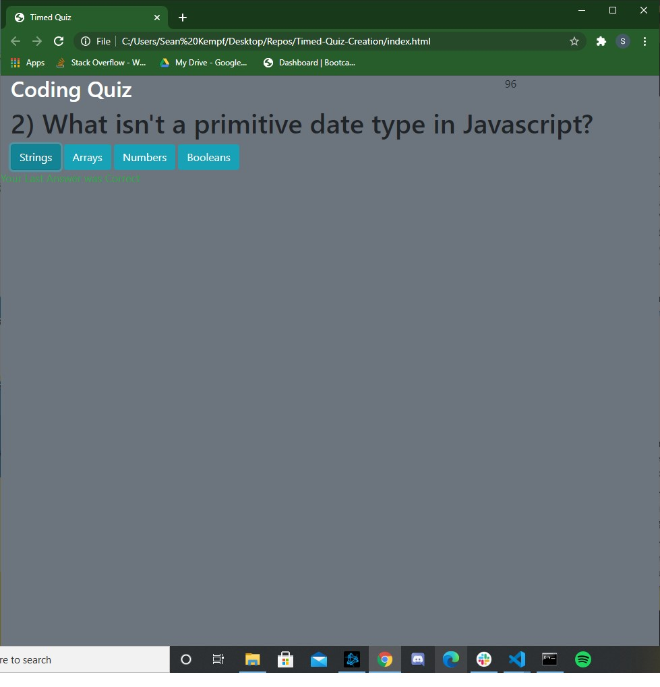

# Timed-Quiz-Creation

## What I Did

### I have created an application that will act as a timed quiz. This quiz has a starting "page", individual question "pages" and a high score "page". I put page in parenthesis here because they aren't individual html pages. They are just portions of the html that are hidden until they are called upon. The questions are pulled from an object that is created at the start of the script. The answer buttons are given text based on an array within each object that are set within the larger object. The correct answer is also determined by matching the text of the button to the correct answer set again in the sub-objects. Finally the scores "page" is set to give the user a score based on the time remaining. The user will loser time if they answer a question wrong. The user will input their initials, or any text, and it will be displayed on a list. This list will be created by pulling on the local storage of the browser. 

## Struggles
### I had struggled with this project quite a bit. I started off strong with creating the questions and declaring a lot of what I needed to from the start. However, the more I started diving into it, the more I realized I need to continually add to it so that it would work. It first was the questions, then it was the answer buttons. After, I had to make it when an answer would click, not only would it register with the right or wrong answer, it would then go to the next question. I then realized the difficulty of figuring out once it ended, how to display the scores. I can display the current score, my only problem is that it won't display previous scores. Despite knowing that I need to ask for help more often, it's finally kicking me and making me understand that I should have reached out sooner to figure this out. This was my biggest struggle for sure. If I didn't spend so much time on it, I probably could have spent more time on making the actual application look decent. I have an alright understanding of what I did, I just need to start adjusting for when I don't understand. 

## The Application 
